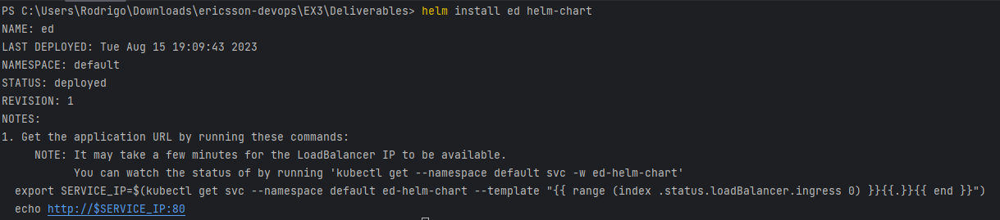

## Helm Chart and Kubernetes

### 1) Deliverables

Upload you solution here. Also, use this space to document a what you did in this exercise.

I created a Helm chart using the Helm CLI, changing the values.yaml file to point to the image created in Docker Hub and the service type to a LoadBalancer one.
I was able to test it while trying to deploy the application in an Azure Kubernetes Service instance and after ``helm install``, the command seems to be working fine.

When checking the application itself, it cannot stay up in the cluster for too long, mostly because the application performs its tasks very fast (less than 5 seconds), and since it's not exposing any endpoint or service, it's not possible to perform health checks to make sure it's still up.